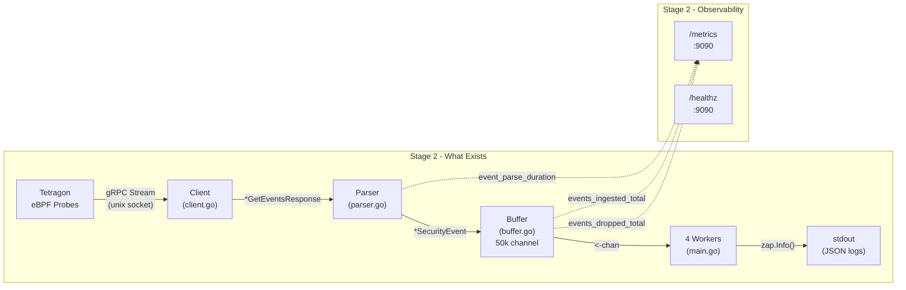
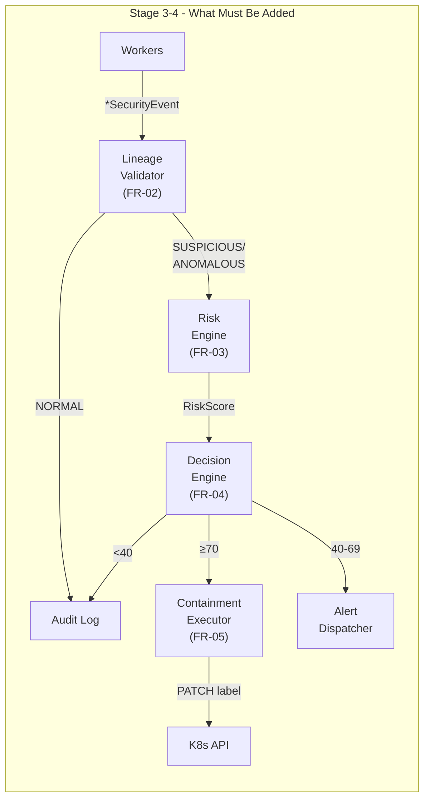

# ZTRE Stage 2 — Architectural Evaluation

**Date:** 2026-09-14  
**Scope:** Stage 2 — Event Pipeline (FR-01)  
**Files Reviewed:** All source in `pkg/collector/`, `pkg/observability/`, `cmd/ztre-agent/main.go`, `deploy/Dockerfile`, `go.mod`, config files  
**Reference Documents:** [PRD.md](file:///home/execute/ZTRE/PRD.md), [DEVELOPMENT_ROADMAP.md](file:///home/execute/ZTRE/DEVELOPMENT_ROADMAP.md)

---

## Executive Summary

Stage 2 delivers a **functional, well-structured event ingestion pipeline** that successfully streams Tetragon kernel events over gRPC, parses them into a normalized data model, buffers them with backpressure handling, and exposes Prometheus observability. The code is clean, idiomatic Go, and the architecture is sound for an MVP.

However, there are **architectural decisions that will create friction in Stages 3–4**, and several **gaps against PRD requirements** that need to be addressed before the pipeline can be considered production-grade. This evaluation categorizes findings by severity.

---

## 1. PRD Alignment Analysis

### FR-01 — Event Interception & Telemetry Ingestion

| Acceptance Criterion | Status | Evidence |
|---|---|---|
| End-to-end latency < 500ms from kernel event to pipeline entry | ✅ **MET** | Benchmark: 318.5 ns/op. Parser + channel push is sub-microsecond. |
| Handles burst of 10,000 events/sec without dropping | ✅ **MET** | Benchmark: 3.1M events/sec. 310× headroom above requirement. |
| Gracefully reconnects to Tetragon on stream interruption | ✅ **MET** | [`client.go#L56-L90`](file:///home/execute/ZTRE/pkg/collector/client.go#L56-L90): Exponential backoff reconnect loop. |

### NFR-03 — Performance & Low Overhead

| Metric | Requirement | Status | Notes |
|---|---|---|---|
| CPU ≤ 2% | ≤ 2% | ⚠️ **UNTESTED** | No CPU profiling in Stage 2. Likely met given the zero-allocation parser path, but unverified. |
| Memory ≤ 128MB | ≤ 128MB | ⚠️ **RISK** | `RawResponse` field retains full protobuf message per event (see §2.3). With 50k buffer at capacity, worst-case memory could be significant. |
| Throughput ≥ 10k/sec | ≥ 10k/sec | ✅ **MET** | 3.1M ops/sec in benchmark. |
| E2E containment ≤ 5s | ≤ 5s | N/A | Stage 4 concern. Pipeline latency is negligible. |

### NFR-05 — Reliability & Resilience

| Criterion | Status | Notes |
|---|---|---|
| Auto-reconnect on Tetragon restart | ✅ **MET** | Backoff reconnect with 1s initial, 10s max. |
| K8s API retry with backoff | N/A | Stage 4. |
| Agent crash recovery | ⚠️ **PARTIAL** | No persistence or WAL. In-flight events in buffer are lost on crash. Acceptable for MVP. |

### NFR-06 — Observability

| Criterion | Status | Notes |
|---|---|---|
| Structured JSON logs | ✅ **MET** | Zap with JSON encoder, ISO8601 timestamps. |
| `ztre_events_ingested_total` | ✅ **MET** | Registered with `event_type` and `namespace` labels. |
| `ztre_events_dropped_total` | ✅ **MET** | Simple counter (no labels). |
| `ztre_event_parse_duration_seconds` | ✅ **MET** | Histogram with microsecond-scale buckets. |

> [!TIP]
> **Overall FR-01 verdict:** All 3 acceptance criteria are met. The pipeline exceeds throughput requirements by 2 orders of magnitude. This is a solid Stage 2 delivery.

---

## 2. Architectural Decision Critique

### 2.1 ✅ Decision: Bounded Channel Buffer with Drop Strategy

**Implementation:** [`buffer.go`](file:///home/execute/ZTRE/pkg/collector/buffer.go) — Go buffered channel (50k capacity), non-blocking `select` with `default` drop.

**Assessment: GOOD**

This is the right choice for a security agent:
- **Predictable memory ceiling.** A channel of 50k `*SecurityEvent` pointers is ~400KB of pointer storage. The actual memory depends on event size, but the ceiling is bounded.
- **Non-blocking producer.** The Tetragon gRPC stream goroutine never blocks on a slow consumer. This prevents cascading backpressure into the kernel event stream.
- **Drop-tail is correct for security workloads.** When overwhelmed, it's better to drop new events and keep processing existing ones than to block and create an unbounded backlog. Dropped events are counted and alarmed via Prometheus.

**One concern:** The log throttling at `d%100 == 1` uses modular arithmetic on the *cumulative* drop count. After 10,000 drops, you'll log at 10001, 10101, 10201... This is fine, but consider using a `time.Since(lastLogTime)` approach instead for more predictable log intervals under sustained pressure.

### 2.2 ✅ Decision: Type-Switch Parser Over Interface Polymorphism

**Implementation:** [`parser.go`](file:///home/execute/ZTRE/pkg/collector/parser.go) — Single `Parse()` method with a Go type switch on `res.GetEvent().(type)`.

**Assessment: GOOD**

- The type switch directly mirrors the Protobuf `oneof` semantics. This is idiomatic Go for working with generated Protobuf types.
- It keeps the parser as a single, testable function with clear input/output.
- Adding new event types (e.g., `ProcessTracepoint`, `ProcessLsm`) is a single `case` addition.

**However**, there's significant code duplication across the three cases (see §3.1).

### 2.3 ⚠️ Decision: Retaining `RawResponse` on SecurityEvent

**Implementation:** [`types.go#L35`](file:///home/execute/ZTRE/pkg/collector/types.go#L35) — `RawResponse *tetragon.GetEventsResponse` field with `json:"-"`.

**Assessment: CONCERNING**

The `SecurityEvent` struct holds a pointer to the full Protobuf `GetEventsResponse`. This means:

1. **Memory retention:** Every event in the 50k buffer keeps the entire Protobuf message tree alive (including all nested `Process`, `Pod`, `Container` objects). The GC cannot reclaim any of it until the event is consumed and drops all references.

2. **No current consumer uses it.** Stage 2 workers only log extracted fields. The `RawResponse` is dead weight right now.

3. **Future risk:** If Stage 3/4 processing is slower than ingestion (which is likely — risk scoring involves YAML lookups, K8s API calls), the buffer could hold 50k full Protobuf responses simultaneously. Each `GetEventsResponse` can be 1-5KB. At 50k capacity: **50-250MB of retained Protobuf data**, which would blow past the 128MB NFR-03 memory limit.

> [!WARNING]
> **Recommendation:** Remove `RawResponse` from `SecurityEvent` or make it opt-in (only populated when needed for forensic logging). The normalized fields are sufficient for all downstream processing defined in the PRD.

### 2.4 ✅ Decision: gRPC Client with Manual Reconnect Loop

**Implementation:** [`client.go#L56-L90`](file:///home/execute/ZTRE/pkg/collector/client.go#L56-L90) — Manual `for` loop with `time.After` backoff.

**Assessment: ADEQUATE**

- The reconnect loop is simple, correct, and handles context cancellation properly.
- Using `grpc.NewClient` (not the deprecated `grpc.Dial`) is the correct modern API.

**Issues:**
- **Backoff never resets on success.** After reconnecting successfully, the `backoff` variable isn't reset to `config.ReconnectInterval`. If the stream drops again after a long-running session, it will use the last (possibly maxed-out) backoff value instead of starting fresh.
- **`select { case <-ctx.Done(): default: }` before `stream.Recv()`** ([line 113-117](file:///home/execute/ZTRE/pkg/collector/client.go#L113-L117)): This is a busy-poll pattern. `stream.Recv()` is already context-aware — when `ctx` is cancelled, `Recv()` returns with `ctx.Err()`. The extra `select` on every iteration adds unnecessary overhead and is a code smell.

### 2.5 ✅ Decision: Global Prometheus Metrics with `init()` Registration

**Implementation:** [`metrics.go`](file:///home/execute/ZTRE/pkg/observability/metrics.go) — Package-level `var` block with `init()` calling `prometheus.MustRegister`.

**Assessment: FUNCTIONAL but FRAGILE**

- Works fine for a single-binary deployment.
- **Testing hazard:** `init()` + `MustRegister` panics if metrics are registered twice (e.g., when tests import the package multiple times). This hasn't bitten you yet because tests are in the `collector` package (which imports `observability`), but it will when you add integration tests that import both.
- **Better pattern:** Use a custom `prometheus.Registry` injected via a constructor, or use `prometheus.MustRegister` with a sync.Once guard.

### 2.6 ⚠️ Decision: Hardcoded 4-Worker Pool

**Implementation:** [`main.go#L59`](file:///home/execute/ZTRE/cmd/ztre-agent/main.go#L59) — `const workerCount = 4`.

**Assessment: QUESTIONABLE**

- The worker count is not configurable via flags or config.
- With 4 workers sharing a single channel, the overhead of channel contention may actually be *higher* than a single goroutine, since the current workers only log events (zero computation). Multiple goroutines competing for `<-channel` creates unnecessary lock contention on the channel's internal mutex.
- For Stage 2 (log-only), 1 worker would be faster. For Stage 3-4 (validation + risk scoring + K8s API calls), the workers should be doing real work, and the count should be tunable.

---

## 3. Code Quality Assessment

### 3.1 🔴 Parser Code Duplication

The three `case` branches in [`parser.go`](file:///home/execute/ZTRE/pkg/collector/parser.go) are nearly identical — they all extract `proc`, `pod`, check for nil, and build a `SecurityEvent` with the same field mappings. The only differences are:

| Branch | EventType | Has Parent? | Has Container? |
|---|---|---|---|
| `ProcessExec` | `execve` | ✅ from `exec.GetParent()` | ✅ |
| `ProcessExit` | `exit` | ❌ not extracted | ❌ not extracted |
| `ProcessKprobe` | `kprobe` | ✅ from `kprobe.GetParent()` | ✅ |

This means `ProcessExit` is **missing parent and container extraction** — not by design, but because the duplicated code forgot to include it. This is a bug caused by copy-paste duplication.

> [!CAUTION]
> **ProcessExit events will have empty `ParentBinary`, `ParentPID`, and `ContainerID` fields.** This will cause problems in Stage 3's lineage validation, which relies on parent-child relationships. The `ProcessExit` event in Tetragon *does* carry `Parent` data.

**Recommendation:** Extract a helper function:
```go
func extractCommonFields(proc *tetragon.Process, res *tetragon.GetEventsResponse, eventType EventType) *SecurityEvent
```

### 3.2 🟡 Missing Error Return from Parser

The `Parse()` method signature returns `(*SecurityEvent, error)` but **never returns a non-nil error**. Every branch either returns `(event, nil)` or `(nil, nil)`. The `error` return is effectively dead code.

This isn't necessarily wrong — the current parser truly doesn't encounter errors. But it means the error handling in [`client.go#L128-L131`](file:///home/execute/ZTRE/pkg/collector/client.go#L128-L131) (which logs at Debug level and continues) will never fire. Consider whether the error return is needed, or add actual validation that could fail.

### 3.3 🟡 No Graceful Drain on Shutdown

When `cancel()` is called in [`main.go#L104`](file:///home/execute/ZTRE/cmd/ztre-agent/main.go#L104):
1. The Tetragon client stops streaming (good).
2. The buffer is closed via `defer eventBuffer.Close()` (good).
3. Worker goroutines exit via `case <-ctx.Done()` or `!ok` on channel (good).

**But:** There's no waiting for workers to finish processing remaining buffered events. After `cancel()`, the main goroutine immediately shuts down the metrics server and exits. Events already in the buffer are silently lost.

**Recommendation:** Add a `sync.WaitGroup` for workers, and after `cancel()`, wait for workers to drain the buffer before shutting down:
```go
cancel()           // stop producer
wg.Wait()          // wait for consumers to drain
metricsServer.Shutdown(...)  // then shutdown
```

### 3.4 🟢 Dockerfile — Excellent

The multi-stage build from `golang:alpine` → `gcr.io/distroless/static:nonroot` is best-practice:
- Minimal attack surface (no shell, no package manager in runtime image).
- Non-root user (`65532`).
- Static binary with `CGO_ENABLED=0` and stripped symbols (`-ldflags="-w -s"`).
- 6.52MB final image is outstanding.

### 3.5 🟡 Test Coverage — Adequate but Shallow

| File | Tests | Coverage Assessment |
|---|---|---|
| `parser_test.go` | 2 tests | Only `ProcessExec` and host-event-filter. No `ProcessExit`, `ProcessKprobe`, nil-response, or nil-process tests. |
| `buffer_test.go` | 2 tests + 1 benchmark | Push/pop and overflow. No concurrent push test, no close-while-pushing test. |
| `client.go` | 0 tests | No mock gRPC server tests. Roadmap Step 2.1 explicitly requires this. |
| `metrics.go` | 0 tests | No verification that metrics increment correctly. |
| `logger.go` | 0 tests | Trivial enough to skip. |

> [!IMPORTANT]
> **Stage 2 Gate says:** "Pipeline handles 10,000 events/sec without dropping" — this was verified via benchmark but not via a proper load test with the full pipeline (client → parser → buffer → workers).

---

## 4. Architecture Diagram — Current vs. Required





---

## 5. Findings Summary (Ranked by Severity)

| # | Severity | Component | Finding | Impact |
|---|---|---|---|---|
| **F1** | 🔴 **High** | `parser.go` | `ProcessExit` branch missing parent/container extraction | Stage 3 lineage validation will fail for exit events |
| **F2** | 🔴 **High** | `types.go` | `RawResponse` retains full Protobuf in buffer | Memory could exceed 128MB NFR-03 limit under sustained load |
| **F3** | 🟡 **Medium** | `client.go` | Backoff never resets after successful reconnect | After brief disconnect, next reconnect uses max backoff instead of initial |
| **F4** | 🟡 **Medium** | `main.go` | No graceful buffer drain on shutdown | In-flight events silently lost during graceful shutdown |
| **F5** | 🟡 **Medium** | `client.go` | Redundant `select{ctx.Done()}` before `stream.Recv()` | Unnecessary overhead, `Recv()` is already context-aware |
| **F6** | 🟡 **Medium** | `parser_test.go` | Only 2 test cases; no ProcessExit/Kprobe/nil tests | Low confidence in parser correctness for untested paths |
| **F7** | 🟢 **Low** | `metrics.go` | `init()` + `MustRegister` will panic in cross-package tests | Testing friction in Stage 3+ |
| **F8** | 🟢 **Low** | `main.go` | Worker count hardcoded to 4 | Not tunable; unnecessary contention for log-only workload |
| **F9** | 🟢 **Low** | `agent_config.yaml` | Config files exist but aren't loaded by the agent | Stage 2 uses CLI flags only; configs are placeholder |
| **F10** | 🟢 **Info** | `parser.go` | `error` return never used | Dead code path; misleading API contract |

---

## 6. Stage 3 Readiness Assessment

### ✅ Ready

- **Data model is extensible.** `SecurityEvent` has all fields needed for lineage validation (`Binary`, `ParentBinary`, `Namespace`, `PodName`).
- **Buffer/worker architecture is correct.** Workers just need to call `validator.Classify(event)` instead of logging.
- **Metrics infrastructure is in place.** Adding `ztre_events_classified_total{status}` is straightforward.
- **Config files are pre-written.** `process_lineage_whitelist.yaml` and `risk_scoring_policy.yaml` match the PRD schema exactly.

### ⚠️ Needs Fixing First

| Item | Why it blocks Stage 3 |
|---|---|
| **F1: ProcessExit missing parent** | Lineage validator needs `ParentBinary` to classify. Exit events will always get wrong classification. |
| **F2: RawResponse memory** | Under real load with Stage 3 processing latency, buffer memory will grow unchecked. |
| **F3: Backoff reset** | Minor but will cause operational confusion during Tetragon upgrades. |

### 🔧 Recommended Pre-Stage-3 Fixes (Priority Order)

1. **Fix `ProcessExit` parser branch** — Extract parent and container data. ~10 lines of code.
2. **Remove `RawResponse` from `SecurityEvent`** — Or change to an optional debug flag. Stage 3/4 don't need raw Protobuf.
3. **Add backoff reset** after successful stream establishment in `client.go`.
4. **Add `sync.WaitGroup`** for worker graceful drain in `main.go`.
5. **Extract common parser helper** to eliminate duplication across the three `case` branches.
6. **Add missing test cases** — at least `ProcessExit`, `ProcessKprobe`, `nil response`, concurrent buffer test.

---

## 7. What Was Done Well

| Aspect | Assessment |
|---|---|
| **Go idioms** | Clean channel-based concurrency, proper `sync.Once` for Close, atomic counters for drops |
| **Protobuf SDK usage** | Correct use of `GetEventsResponse` oneof type switch, proper nil checks on wrapper types |
| **Observability** | Prometheus counters/histograms with meaningful namespace (`ztre_collector_*`), structured JSON logging |
| **Container image** | 6.52MB distroless image, non-root, static binary — production-grade |
| **Performance** | 3.1M events/sec benchmark — 310× above PRD requirement |
| **Security posture** | RBAC restricted to `patch pods` only, verified via `kubectl auth can-i` |
| **Documentation** | `STAGE_2_EXPLAINED.md` is a thorough educational document covering every file |

---

## 8. Strategic Observations

### 8.1 The Config Gap

The agent currently uses **CLI flags** ([`main.go#L17-L28`](file:///home/execute/ZTRE/cmd/ztre-agent/main.go#L17-L28)) exclusively. The three config files in `config/` exist but are **never loaded**. Stage 3 *requires* loading `process_lineage_whitelist.yaml` and `risk_scoring_policy.yaml`. 

You'll need a `pkg/config/` package with YAML loader + hot-reload (file watcher). Plan this before starting Stage 3.

### 8.2 No `k8s.io/client-go` Dependency Yet

The `go.mod` doesn't include `k8s.io/client-go`. This is correct for Stage 2 (no K8s API interaction beyond kubectl), but Stage 4's `ContainmentExecutor` requires it. Adding `client-go` will pull in a massive dependency tree (~50+ transitive deps) and increase build time significantly. Budget time for this.

### 8.3 Event ID / Correlation

`SecurityEvent` has no unique ID field. Stage 3's audit log format (from the roadmap) expects an `event_id: "uuid"`. Consider adding a `uuid.New()` in the parser to assign each event a unique ID for tracing through the pipeline.

### 8.4 PRD vs. Reality: "Python Agent"

The PRD §6.1 says *"user-space **Python** agent"* but you've correctly pivoted to Go. The PRD should be updated to reflect this (or a separate "Decisions Log" document should capture the rationale: performance requirements, Tetragon SDK availability, single-binary deployment). This matters for thesis/portfolio presentation.
